# Camera Folder
This goal of this section is a modular system that can run multiple neural networks/filtering models on an incoming or stored image stream. 

# Architecture

I want this project to test my ability to use different languages, so I want systems to be language agnostic, allowing for different modules of various languages to be added in, so long as they follow a structure. 

```mermaid
graph TD
    Z[Orchestrator] <--> A
    A[Middleware] <-->|Process| B(Processing)
    A[Middleware] <-->|Collect| C(Collecting)
    style B fill:#7C0B2B
    style C fill:#FB4B4E
    style A fill:#3E000C

```

## Orchestrator:
to make things easy the Orchestrator will be made in `C++`, and will call and run the other subsystems and modules. it will also

## Modules
modules are pieces of code that interface with the top level orchestrator using the Middleware, they can be written in any language.

### Types of Modules:

#### *Camera Interface*
this module interfaces with a physical camera, this includes camera calibration.
#### *Filter*
a filter module takes the output of a video stream module and applies some filter to it. 
#### *Neural Network*
a sub catagory of filter, these ones use a neural network, ML or algorithm to detect some features and output those on a seperate stream.
#### *Stream Encoder*
this module takes an image stream and encodes it to the disk using some method of encoding.

### Colors:
-  `#ffcbdd: Fairy Tale`
-  `#fb4b4e: Imperial Red`
-  `#d10000: Engineering Orange`
-  `#7c0b2b: Claret`
-  `#3e000c: Chocolate Cosmos`

## TODO List
1. Check and correct current camera implementation
2. look into camera calibration and ensure image is being unskewed before being saved.
3. start work on orchestrator.